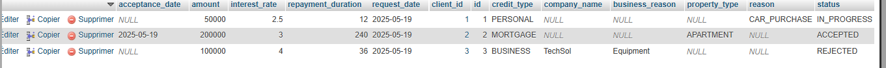

# Examen JEE et arvhitecture distribué

## creation des entites class et enumeration:

## Faire mapping avec les entites

### configuration de applications.properties

### Affichage de BD

### Affichage de credit table

## JPA Repository

### Test jpa operations

### Affichade des donner dans la table Clinet

### Affichage des données dans la table Crédit

